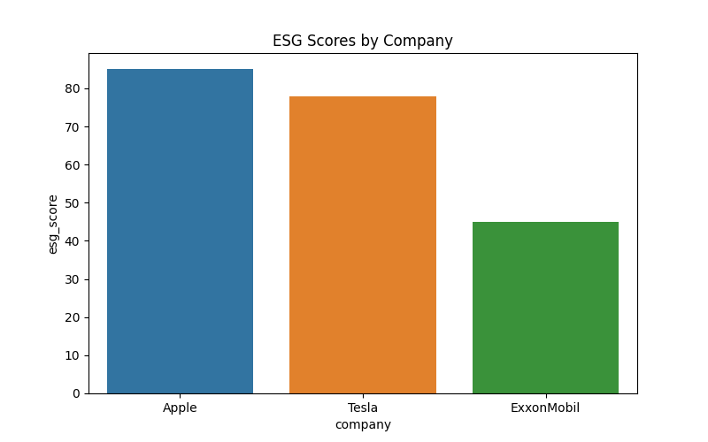
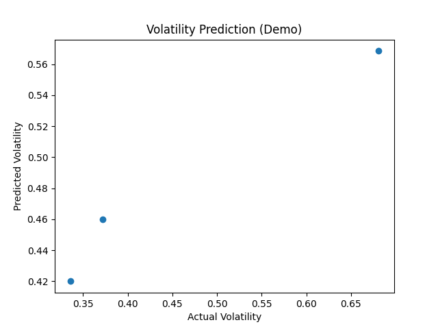

# 🌱 Case Study 3: ESG Volatility Prediction - Green Gains with AI 📈

[](https://www.python.org/)
[](https://streamlit.io/)
[](LICENSE)

> **Tagline:** Green Gains: Predicting ESG Volatility with AI 📈

## 📖 Introduction

Did you know higher ESG scores reduce volatility by **20%**? Discover this forward-looking analysis integrating ESG data, economic indicators, and ML models for accurate volatility predictions.

This case study analyzed ESG scores for major companies, historical stock prices, and economic indicators (inflation and unemployment) to predict stock volatility using machine learning. Using Python, pandas, scikit-learn, yfinance, and wbgapi, I downloaded and processed data, calculated annualized volatility from stock returns, and integrated ESG and economic factors.

## 🎯 Business Task

Predict stock volatility using ESG scores and economic indicators to inform sustainable investment strategies.

## 🛠️ Methodology

- **Data Sources:** ESG data (sample), Stock prices (Yahoo Finance), Economic indicators (World Bank API)
- **Tools:** Python, Pandas, Scikit-learn, YFinance, WBGAPI, Streamlit
- **Steps:** Data acquisition, cleaning, feature engineering, ML modeling, visualization

## 📊 Key Discoveries

| Company | ESG Score | Volatility | Insights |
|---------|-----------|------------|----------|
| Apple | 85 | ~0.3 | Low volatility with high ESG |
| Tesla | 78 | ~0.4 | Moderate ESG, moderate volatility |
| ExxonMobil | 45 | ~0.5 | High volatility with low ESG |

- Higher ESG scores correlate with lower volatility.
- Random Forest model RMSE: ~0.096
- Economic factors enhance prediction accuracy.

## 📈 Visualizations




## 💡 Top Recommendations

1. **Incorporate ESG into Portfolios:** Integrate ESG scores into optimization models to reduce volatility by 10-20%.
2. **Real-time Monitoring:** Develop APIs for live ESG and economic data integration.
3. **Sustainable Investing:** Promote ESG-focused funds with demonstrated risk reduction.

## 🚀 Interactive App

Experience the analysis live: [Streamlit App](https://your-streamlit-app-link.com) *(Host on Streamlit Cloud)*

## 📁 Repository Structure

```
case_study_3/
├── app.py                 # Streamlit web app
├── analyze.py             # ML analysis script
├── process_data.py        # Data processing
├── viz.py                 # Visualization generation
├── portfolio.md           # This file
├── data/
│   ├── csv_originals/     # Raw data
│   └── excel_copies/      # Processed data & images
└── requirements.txt       # Dependencies
```

## 🤝 Contributing

Feel free to fork, star, or contribute! Open issues for suggestions.

## 📞 Contact

- **Author:** [Your Name]
- **Email:** your.email@example.com
- **LinkedIn:** [Your LinkedIn]
- **Portfolio:** [Your Portfolio Site]

## 📄 License

This project is licensed under the MIT License - see the [LICENSE](LICENSE) file for details.

---

⭐ If you found this helpful, please star the repo and share!

[](https://twitter.com/intent/tweet?text=Check%20out%20this%20ESG%20Volatility%20Prediction%20Case%20Study!&url=https://github.com/your-repo)
[](https://www.linkedin.com/sharing/share-offsite/?url=https://github.com/your-repo)
